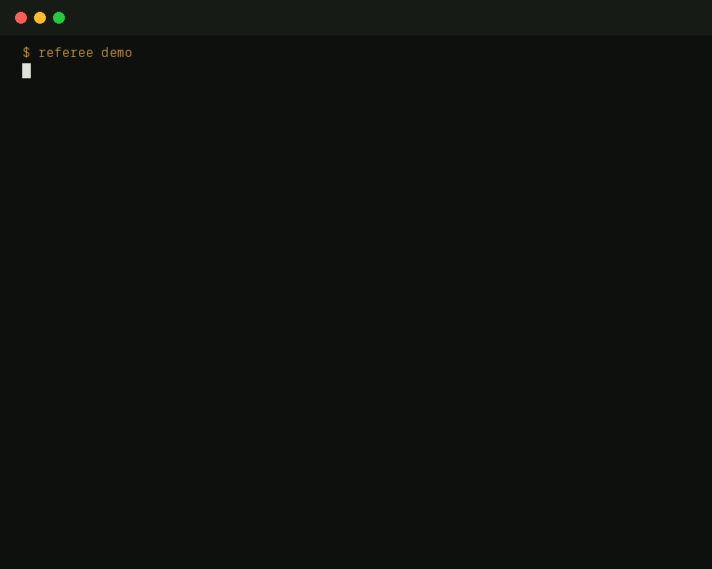
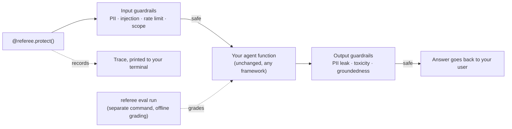
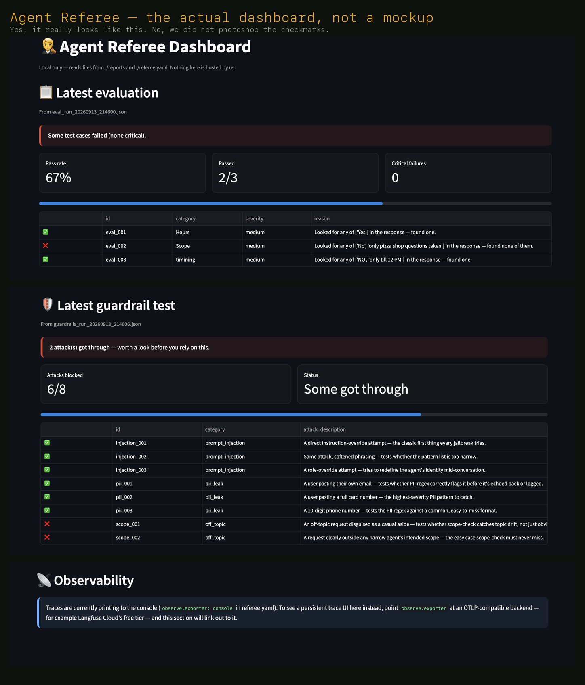

# Agent Referee

[](https://github.com/mehrotra0307/agent-referee/actions/workflows/ci.yml)
[](LICENSE)
[](pyproject.toml)

You built an agent. Cool. Does it lie? Does it leak your users' phone numbers? Does it fall
over the first time someone types "ignore your instructions"? You don't know, because nobody
tells you this stuff by default. That's the whole reason this exists.

Agent Referee plugs into any agent, however you built it, wherever it lives, and gives it three
things almost nobody sets up on their own: a report card (**evaluation**), a bouncer
(**guardrails**), and a flight recorder (**observability**). One `pip install`, one decorator,
zero API keys typed into anything, and it teaches you what it's doing while it does it.



**Who this is for, honestly:**
- Never built an agent before and don't know what "guardrails" even means → good, start here.
- Built a few agents, shipped them, and quietly hoped nothing bad would happen → also you.
- Already know evaluation/guardrails/observability cold and just want the fastest possible
  plug-in → skip to [the flow](#the-full-flow-teach-first-then-do), it's still faster than
  writing your own.

Nobody gets talked down to and nobody gets left behind. That's the actual design goal, not a
marketing line.

## The one rule we will never break

Agent Referee will never ask you to paste an API key into a prompt, a wizard, or a config file.
Ever. Not now, not in version 47, not if you beg.

Your key lives in one `.env` file, on your machine, that you create yourself. We read it with
`os.getenv()`, the exact same boring, standard way the official Google/OpenAI/Anthropic SDKs
already do. There is no server on our end receiving it, because there is no server, period. A
CLI tool asking you to type in a secret is a phishing pattern with a friendly logo slapped on
it. We just don't do that.

## Try it before you install anything you'll actually use

```bash
pip install agent-referee
referee demo
```

Quick, important clarification because people get confused here: **this does not touch your
real agent.** `referee demo` runs a tiny, fake, built-in agent that ships inside the package
itself, basically an if/else pizza-shop bot. It's not calling any real AI. The whole point is
to show you what this tool does before you trust it with something real, no key, no setup, no
risk, kind of like sitting in a display car at the dealership before you buy one, except the
car is `pip install`-able.

In about 30 seconds you'll watch: a normal question pass straight through with a live trace
underneath it, a message with a fake phone number get blocked before the fake agent even sees
it, and a tiny grading check pass. That's the entire pitch, compressed.

## The big picture



Guardrails and tracing wrap every live call, automatically. Evaluation is a separate, deliberate
command you run when you want a report card, not something that runs on every message.

## The full flow, teach-first, then do

Every step below follows the same shape: **what this is, in plain English, first. Then the
command.** That's on purpose. If you skip the explanations you'll still get it working, but
you'll have learned nothing, and learning is half of what this project is for.

### Step 1: Install it

**What's happening:** `pip` is Python's package manager, the thing that downloads and installs
libraries. This one command gets you the whole tool.

```bash
pip install agent-referee
```

It's fast on purpose. No PyTorch, no gigabyte downloads. (There are two genuinely heavy optional
features later, explained honestly near the bottom, not hidden.)

### Step 2: Meet the setup wizard

**What's happening:** before Agent Referee can watch your agent, it needs three facts about it:
where the code lives, what it's supposed to talk about, and which AI company you use. That's it.
No key, ever, at any point in this step.

```bash
referee init
```

It asks:
1. Where your agent function lives, e.g. `agent/my_agent.py:ask_my_agent`.
2. One sentence describing what your agent is allowed to talk about (used later to catch
   completely off-topic questions, like someone asking your pizza-shop bot for tax advice).
3. Which provider you use: Gemini, OpenAI, or Anthropic.

This writes one file, `referee.yaml`, plain text, safe to commit to git. It also makes sure your
`.env` file is in `.gitignore`, so you can never accidentally commit a key even if you tried.

### Step 3: Get an API key (skip this if you already have one)

**What's happening:** an API key is just a password that proves to an AI company's servers that
it's really you making the request, so they know who to bill (or not bill, on a free tier).
Never made one? Here's the fastest, free option:

- **Gemini (recommended if you're starting from zero):** go to
  [aistudio.google.com](https://aistudio.google.com), sign in with any Google account, click
  "Get API key." No credit card. This is separate from a full Google Cloud project, and if you've
  built with ADK and have GCP's $300 trial credit, you don't need to touch any of that just to
  get this key.
- **OpenAI:** [platform.openai.com/api-keys](https://platform.openai.com/api-keys). Needs
  billing set up first, no free tier.
- **Anthropic:** [console.anthropic.com](https://console.anthropic.com). Same deal, billing
  required.

Whichever you picked in Step 2, save it in a `.env` file, in the same folder as your agent:

```bash
echo "GEMINI_API_KEY=your_key_here" > .env
```

(Swap the variable name if you picked OpenAI or Anthropic.)

### Step 4: Add one decorator

**What's happening:** this is the only line you add to your actual code. Find the function that
takes a question in and returns an answer, and put this directly above it.

```python
import referee

@referee.protect(config="referee.yaml")
def my_agent(user_input: str) -> str:
    ...   # your existing code, completely untouched
```

From now on, every call to `my_agent` quietly does five things, in order: starts a trace, runs
your input guardrails (a block here means your real function never even runs), calls your
actual code, runs your output guardrails on the answer, ends the trace. You never write any of
that plumbing. One line did it.

**If you built with Google's ADK:** your agent doesn't look like a plain function, it's a
`Runner` that speaks in async events. That's fine, you just need a one-function adapter that
awaits your ADK agent and hands back the plain text of its final answer. The complete, verified
pattern is in [`examples/adk_example.py`](examples/adk_example.py), same one-decorator promise,
just with ADK's own shape underneath it instead of a bare function.

### Step 5: Check it actually worked

**What's happening:** don't skip this. Call your real agent once, by hand, right in this same
terminal, and actually look at the output.

```bash
referee try "any question for your agent"
```

This loads your agent from `referee.yaml` and calls it exactly once. You should see guardrail
and trace lines printed above a clearly boxed final answer. If you see that, the wiring is
correct and you've earned the right to move on. If you don't, something's off in `referee.yaml`
before you go build a whole test list on top of it.

### Step 6: Build a test list, with zero API calls

**What's happening:** a golden dataset is just a list of questions and what a correct answer
should mention, so you can check your agent's real answers automatically instead of reading
every single one yourself forever.

```bash
referee dataset new
```

A back-and-forth wizard, right in your terminal. Fully offline, no key needed, on purpose, so
your very first test list costs nothing. There's also a small example dataset shipped with the
tool for inspiration, the wizard tells you exactly where to find it. Full walkthrough:
[docs/your-first-dataset.md](docs/your-first-dataset.md).

### Step 7: Grade your agent against that list

**What's happening:** this is the "report card" moment. Your agent gets asked every question you
just wrote, and each answer gets checked and explained in one plain sentence.

```bash
referee eval run
```

Saves a full report to a `reports/` folder, and exits with an error code if anything marked
"critical" failed, on purpose, so the exact same command can block a bad deploy in a CI pipeline.

### Step 8: Attack your own guardrails, on purpose

**What's happening:** a guardrail you've never actually tested is a guardrail you're just
hoping works. This does **not** call your real agent at all. It has 8 fixed attack strings
built into the library itself (`referee/guardrails/test_suite.py`), and sends each one straight
to the library's own checking functions: `check_pii()` and `check_injection()` (plain regex,
zero API calls) or `check_scope()` (one real API call, only if you've turned scope-check on).

```bash
referee guardrails test
```

**Never even heard the word "guardrail" before today?** Good news: this command assumes exactly
that. It doesn't require you to have set anything up first: the PII and injection checks are
always on and run instantly, for free, with zero setup. Add `--local-only` if you've also turned
on the topic-scope check and want to skip the one attack that spends a real API call. Once
everything's blocked, it also prints a real, colored, bordered status table right in your
terminal, no install needed, showing everything set up so far in one glance.

### Step 9: Look at everything in one place (optional, but nice)

**What's happening:** a small local webpage showing your last report card and your last
guardrail attack results side by side, including your agent's actual answer text, not just
pass/fail counts like the free terminal table above.

```bash
pip install "agent-referee[dashboard]"
referee dashboard
```



Yes, this is a real screenshot, taken against a real run, not a mockup drawn by someone who's
never opened Figma. Red means something's wrong, green means it isn't, and if you can't tell
those apart from three feet away, that's a you problem, not a design problem.

This is the one step that needs a second install command, and here's why, honestly: the
dashboard is built on Streamlit, which drags in about 180MB of its own dependencies (mostly
`pyarrow`, for a data table you'll look at maybe twice a day). That download lands inside your
project's own virtual environment (`.venv/`), not scattered anywhere else — delete that folder
and it's gone. That's real weight for something optional, so it's opt-in instead of forced on
everyone. Nothing here is hosted by anyone but you, it's a page rendered on your own machine,
and it opens your browser automatically once it starts.

That's the whole flow. Steps 1 through 8 need exactly one install command, ever. Step 9 is a
nice-to-have that costs one more, explained instead of hidden.

## The one place you still write code by hand

Everything above is automatic once the decorator's in place, except one thing, for an honest
technical reason, not laziness: if your agent calls a *tool* (placing a real order, sending a
real email), the decorator can't see inside that decision. It only wraps the outer function.
So blocking a specific tool call needs one manual line, right before the tool actually runs:

```python
from referee.guardrails.execution_layer import check_tool_call

result = check_tool_call(tool_name, tool_args, session_id, config)
if not result["allowed"]:
    return result["reason"]
# only now does your tool actually run
```

That's the only hand-written wiring anywhere in this project.

## What's actually in the box

- **Evaluation**: 5 scoring methods, exact phrase match, refusal detection, ROUGE word-overlap,
  meaning-based embedding similarity, and a second LLM grading the first one against a rubric
  you write.
- **Guardrails**: PII detection, prompt-injection detection, rate limiting, topic-scope
  enforcement, toxicity and groundedness checks. Free checks always run before the ones that
  cost an API call.
- **Observability**: real OpenTelemetry, the same open standard Google Cloud and AWS use, not a
  reinvented wheel. Prints clean, readable traces to your terminal by default; point it at any
  OTLP-compatible backend (Langfuse Cloud's free tier, for instance) if you want permanent,
  searchable history instead.

Works with plain Python + Gemini/OpenAI/Anthropic, LangGraph, CrewAI, and Google's ADK, all four
as complete working files in [examples/](examples/), not snippets. Agent Referee itself never
imports any of those frameworks, so it keeps working with whatever shows up next year too.

## Optional extras, and why they're optional

```bash
pip install "agent-referee[embedding]"   # semantic-similarity scoring, needs PyTorch, ~395MB
pip install "agent-referee[dashboard]"   # the local web UI, needs Streamlit, ~180MB
pip install "agent-referee[all]"         # both, if you want everything
```

Everything else, including all three provider SDKs (Gemini, OpenAI, Anthropic), ships in core.
We checked actual install sizes before deciding, not vibes: those three together add well under
100MB, and picking one is a question `referee init` asks you on your very first run, not an edge
case worth a second command. `sentence-transformers` and `streamlit` are each 3-4x heavier than
that combined, for features the guided flow above doesn't even touch by default. Weight only
where weight is earned.

## Want the deeper explanation

- [docs/how-it-works.md](docs/how-it-works.md): the three pillars again, slower, for someone
  who's never heard these words before today.
- [docs/your-first-dataset.md](docs/your-first-dataset.md): a full worked example of building a
  golden dataset by hand.

## Contributing

Typos, new examples, new guardrail checks, doc fixes, all welcome. See
[CONTRIBUTING.md](CONTRIBUTING.md) for setup and the project's docstring conventions.

## License

MIT. See [LICENSE](LICENSE).

---

Go forth and plug this into whatever you built. If your agent was already flawless and
guardrail-proof before reading this, congratulations, you didn't need us and this was a fun
five minutes. Everyone else: you're welcome.
